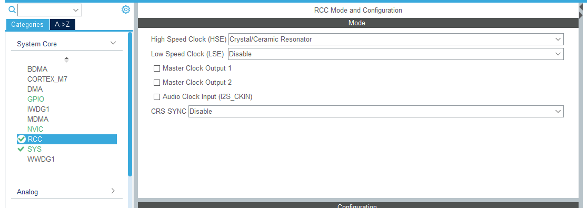

# H750 TouchGFX移植手册

### 初始化HSI外部时钟以及时钟树



- 如果遇到Frequency searched for is out of range for this VOS range


### 打开I_Cache与D_Cache


### 配置外部DRAM


### 配置LTDC


- 注意默认初始化引脚和原理图对应的引脚可能不一致，需要手动更改

    

- 注意每个屏幕的参数都有一定的差别，请参照例程与屏幕数据手册进行对应的修改


### 打开CRC检查


### 使能DMA2D


### 控制背光打开


### 添加TouchGFX软件包


### 利用TouchGFX生成对应GUI代码


### 添加SDRAM初始化程序

- fmc.c

```python
/* USER CODE BEGIN 0 */
//发送SDRAM初始化序列
void SDRAM_Initialization_Sequence(SDRAM_HandleTypeDef *hsdram)
{
	uint32_t temp=0;

    //SDRAM控制器初始化完成以后还需要按照如下顺序初始化SDRAM
    SDRAM_Send_Cmd(0,FMC_SDRAM_CMD_CLK_ENABLE,1,0); //时钟配置使能
    HAL_Delay(1);                                  //至少延时200us
	SDRAM_Send_Cmd(0,FMC_SDRAM_CMD_PALL,1,0);       //对所有存储区预充电
    SDRAM_Send_Cmd(0,FMC_SDRAM_CMD_AUTOREFRESH_MODE,8,0);//设置自刷新次数 
    //配置模式寄存器,SDRAM的bit0~bit2为指定突发访问的长度，
	//bit3为指定突发访问的类型，bit4~bit6为CAS值，bit7和bit8为运行模式
	//bit9为指定的写突发模式，bit10和bit11位保留位
	temp=(uint32_t)SDRAM_MODEREG_BURST_LENGTH_4          |	//设置突发长度:1(可以是1/2/4/8)
              SDRAM_MODEREG_BURST_TYPE_SEQUENTIAL   |	//设置突发类型:连续(可以是连续/交错)
              SDRAM_MODEREG_CAS_LATENCY_2           |	//设置CAS值:2(可以是2/3)
              SDRAM_MODEREG_OPERATING_MODE_STANDARD |   //设置操作模式:0,标准模式
              SDRAM_MODEREG_WRITEBURST_MODE_SINGLE;     //设置突发写模式:1,单点访问
    SDRAM_Send_Cmd(0,FMC_SDRAM_CMD_LOAD_MODE,1,temp);   //设置SDRAM的模式寄存器
    
    //刷新频率计数器(以SDCLK频率计数),计算方法:
	//COUNT=SDRAM刷新周期/行数-20=SDRAM刷新周期(us)*SDCLK频率(Mhz)/行数
    //我们使用的SDRAM刷新周期为64ms,SDCLK=200/2=100Mhz,行数为8192(2^13).
	//所以,COUNT=64*1000*100/8192-20=677
	HAL_SDRAM_ProgramRefreshRate(&hsdram1,677);	
}

uint8_t SDRAM_Send_Cmd(uint8_t bankx,uint8_t cmd,uint8_t refresh,uint16_t regval)
{
    uint32_t target_bank=0;
    FMC_SDRAM_CommandTypeDef Command;
    
    if(bankx==0) target_bank=FMC_SDRAM_CMD_TARGET_BANK1;       
    else if(bankx==1) target_bank=FMC_SDRAM_CMD_TARGET_BANK2;   
    Command.CommandMode=cmd;                //命令
    Command.CommandTarget=target_bank;      //目标SDRAM存储区域
    Command.AutoRefreshNumber=refresh;      //自刷新次数
    Command.ModeRegisterDefinition=regval;  //要写入模式寄存器的值
    if(HAL_SDRAM_SendCommand(&hsdram1,&Command,0XFFFF)==HAL_OK) //向SDRAM发送命令
    {
        return 0;  
    }
    else return 1;    
}

/* USER CODE END 0 */
```

```python
/* USER CODE BEGIN FMC_Init 2 */
	SDRAM_Initialization_Sequence(&hsdram1);//发送SDRAM初始化序列
  /* USER CODE END FMC_Init 2 */
```

fmc.h

```python
/* USER CODE BEGIN Private defines */
#define SDRAM_MODEREG_BURST_LENGTH_1             ((uint16_t)0x0000)
#define SDRAM_MODEREG_BURST_LENGTH_2             ((uint16_t)0x0001)
#define SDRAM_MODEREG_BURST_LENGTH_4             ((uint16_t)0x0002)
#define SDRAM_MODEREG_BURST_LENGTH_8             ((uint16_t)0x0004)
#define SDRAM_MODEREG_BURST_TYPE_SEQUENTIAL      ((uint16_t)0x0000)
#define SDRAM_MODEREG_BURST_TYPE_INTERLEAVED     ((uint16_t)0x0008)
#define SDRAM_MODEREG_CAS_LATENCY_2              ((uint16_t)0x0020)
#define SDRAM_MODEREG_CAS_LATENCY_3              ((uint16_t)0x0030)
#define SDRAM_MODEREG_OPERATING_MODE_STANDARD    ((uint16_t)0x0000)
#define SDRAM_MODEREG_WRITEBURST_MODE_PROGRAMMED ((uint16_t)0x0000)
#define SDRAM_MODEREG_WRITEBURST_MODE_SINGLE     ((uint16_t)0x0200)
/* USER CODE END Private defines */
```

```python
/* USER CODE BEGIN Prototypes */
uint8_t SDRAM_Send_Cmd(uint8_t bankx,uint8_t cmd,uint8_t refresh,uint16_t regval);
void SDRAM_Initialization_Sequence(SDRAM_HandleTypeDef *hsdram);
/* USER CODE END Prototypes */
```

### 添加QSPI外置代码存储器映射

- stm32h7xx_hal.c

```python
void QSPI_Enable_Memmapmode(void)
{
	unsigned int tempreg=0; 
	volatile unsigned int *data_reg=&QUADSPI->DR;
	GPIO_InitTypeDef qspi_gpio;
	
	RCC->AHB4ENR|=1<<1;    						//使能PORTB时钟	   
	RCC->AHB4ENR|=1<<5;    						//使能PORTF时钟	   
	RCC->AHB3ENR|=1<<14;   						//QSPI时钟使能

	qspi_gpio.Pin=GPIO_PIN_6;					//PB6 AF10	
	qspi_gpio.Mode=GPIO_MODE_AF_PP;
	qspi_gpio.Speed=GPIO_SPEED_FREQ_VERY_HIGH;
	qspi_gpio.Pull=GPIO_NOPULL;
	qspi_gpio.Alternate=GPIO_AF10_QUADSPI;
	HAL_GPIO_Init(GPIOB,&qspi_gpio);
	
	qspi_gpio.Pin=GPIO_PIN_2;					//PB2 AF9	
	qspi_gpio.Alternate=GPIO_AF9_QUADSPI;
	HAL_GPIO_Init(GPIOB,&qspi_gpio);
	
	qspi_gpio.Pin=GPIO_PIN_6|GPIO_PIN_7;		//PF6,7 AF9	
	qspi_gpio.Alternate=GPIO_AF9_QUADSPI;
	HAL_GPIO_Init(GPIOF,&qspi_gpio);
	
	qspi_gpio.Pin=GPIO_PIN_8|GPIO_PIN_9;		//PF8,9 AF10		
	qspi_gpio.Alternate=GPIO_AF10_QUADSPI;
	HAL_GPIO_Init(GPIOF,&qspi_gpio);
	
	//QSPI设置，参考QSPI实验的QSPI_Init函数
	RCC->AHB3RSTR|=1<<14;			//复位QSPI
	RCC->AHB3RSTR&=~(1<<14);		//停止复位QSPI
	while(QUADSPI->SR&(1<<5));		//等待BUSY位清零 
	QUADSPI->CR=0X01000310;			//设置CR寄存器,这些值怎么来的，请参考QSPI实验/看H750参考手册寄存器描述分析
	QUADSPI->DCR=0X00160401;		//设置DCR寄存器
	QUADSPI->CR|=1<<0;				//使能QSPI 

	//注意:QSPI QE位的使能，在QSPI烧写算法里面，就已经设置了
	//所以,这里可以不用设置QE位，否则需要加入对QE位置1的代码
	//不过,代码必须通过仿真器下载,直接烧录到外部QSPI FLASH,是不可用的
	//如果想直接烧录到外部QSPI FLASH也可以用,则需要在这里添加QE位置1的代码
	
	//W25QXX进入QPI模式（0X38指令）
	while(QUADSPI->SR&(1<<5));		//等待BUSY位清零 
	QUADSPI->CCR=0X00000138;		//发送0X38指令，W25QXX进入QPI模式
	while((QUADSPI->SR&(1<<1))==0);	//等待指令发送完成
	QUADSPI->FCR|=1<<1;				//清除发送完成标志位 	

	//W25QXX写使能（0X06指令）
	while(QUADSPI->SR&(1<<5));		//等待BUSY位清零 
	QUADSPI->CCR=0X00000106;		//发送0X06指令，W25QXX写使能
	while((QUADSPI->SR&(1<<1))==0);	//等待指令发送完成
	QUADSPI->FCR|=1<<1;				//清除发送完成标志位 
	
	//W25QXX设置QPI相关读参数（0XC0）
	while(QUADSPI->SR&(1<<5));		//等待BUSY位清零 
	QUADSPI->CCR=0X030003C0;		//发送0XC0指令，W25QXX读参数设置
	QUADSPI->DLR=0;
	while((QUADSPI->SR&(1<<2))==0);	//等待FTF
	*(unsigned char *)data_reg=3<<4;			//设置P4&P5=11,8个dummy clocks,104M
	QUADSPI->CR|=1<<2;				//终止传输 
	while((QUADSPI->SR&(1<<1))==0);	//等待数据发送完成
	QUADSPI->FCR|=1<<1;				//清除发送完成标志位  
	while(QUADSPI->SR&(1<<5));		//等待BUSY位清零 	 

	//MemroyMap 模式设置
	while(QUADSPI->SR&(1<<5));		//等待BUSY位清零 
	QUADSPI->ABR=0;					//交替字节设置为0，实际上就是W25Q 0XEB指令的,M0~M7=0
	tempreg=0XEB;					//INSTRUCTION[7:0]=0XEB,发送0XEB指令（Fast Read QUAD I/O）
	tempreg|=3<<8;					//IMODE[1:0]=3,四线传输指令
	tempreg|=3<<10;					//ADDRESS[1:0]=3,四线传输地址
	tempreg|=2<<12;					//ADSIZE[1:0]=2,24位地址长度
	tempreg|=3<<14;					//ABMODE[1:0]=3,四线传输交替字节
	tempreg|=0<<16;					//ABSIZE[1:0]=0,8位交替字节(M0~M7)
	tempreg|=6<<18;					//DCYC[4:0]=6,6个dummy周期
	tempreg|=3<<24;					//DMODE[1:0]=3,四线传输数据
	tempreg|=3<<26;					//FMODE[1:0]=3,内存映射模式
	QUADSPI->CCR=tempreg;			//设置CCR寄存器
	
	//设置QSPI FLASH空间的MPU保护
	SCB->SHCSR&=~(1<<16);			//禁止MemManage 
	MPU->CTRL&=~(1<<0);				//禁止MPU
	MPU->RNR=0;						//设置保护区域编号为0(1~7可以给其他内存用)
	MPU->RBAR=0X90000000;			//基地址为0X9000 000,即QSPI的起始地址
	MPU->RASR=0X0303002D;			//设置相关保护参数(禁止共用,允许cache,允许缓冲),详见MPU实验的解析
	MPU->CTRL=(1<<2)|(1<<0);		//使能PRIVDEFENA,使能MPU 
	SCB->SHCSR|=1<<16;				//使能MemManage
}
```

